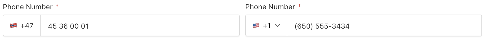

# Payload CMS Phone Number Plugin

[](https://github.com/payloadcms/payload)
[](https://www.npmjs.com/package/payload-phone-number-plugin)

This Payload CMS plugin uses [google-libphonenumber](https://github.com/ruimarinho/google-libphonenumber) to format and validate phone numbers.



## Features
- Format phone numbers to multiple formats (E.164, national, international)
- As-you-type formatting based on selected country
- Validates phone numbers based on selected country
- Support for limiting selection to only some countries
- Support for setting a default country
- Automatic formatting and region detection when pasting international phone numbers
- Full TypeScript support with generated phone number types
- Built with Payload UI components so it feels native to the Admin Panel
- i18n support for validation messages (PRs for new languages are welcome)

## Installation

Install the `payload-phone-number-plugin` package into your project

```bash
pnpm install payload-phone-number-plugin
```

Add the plugin to your Payload Config:
```ts
import { phoneNumberPlugin } from 'payload-phone-number-plugin';

export const config = buildConfig({
  plugins: [
    phoneNumberPlugin(),
  ]
});
```

Then you can use the phone number field:
```ts
import { phoneNumberField } from 'payload-phone-number-plugin';

const Employees: CollectionConfig = {
  slug: 'employees',
  fields: [
    phoneNumberField({
      name: 'phoneNumber',
      label: 'Phone Number',
      required: true,
    }),
  ]
};
```

> [!NOTE]
> Remember to update your importMap with `generate:importmap` since this plugin adds a custom component

## Field Props

| Name                        | Type                                           | Required | Description                                                                                    | Default           |
| --------------------------- | ---------------------------------------------- | -------- | ---------------------------------------------------------------------------------------------- | ----------------- |
| `defaultCountry`            | `RegionCode`                                   | `false`  | The default country region code for the field (ISO 3166-1 alpha-2)                             | `'US'`            |
| `allowedCountries`          | `RegionCode[]`                                 | `false`  | Array of allowed country codes. If specified, restricts user selection to these countries only |                   |
| `admin.cellDisplayFormat`   | `'e164'` \| `'national'` \| `'international'`  | `false`  | The format to display phone numbers in table cells                                             | `'international'` |

### Example with Default Country

```ts
phoneNumberField({
  name: 'phoneNumber',
  label: 'Phone Number',
  defaultCountry: 'NO', // Norway will be pre-selected
})
```

### Example with Allowed Countries

```ts
phoneNumberField({
  name: 'phoneNumber',
  label: 'Phone Number',
  allowedCountries: ['NO', 'US', 'SE'], // Only these countries will be selectable
})
```

### Example with Default Country and Allowed Countries

```ts
phoneNumberField({
  name: 'phoneNumber',
  label: 'Phone Number',
  defaultCountry: 'NO', // Norway will be pre-selected
  allowedCountries: ['NO', 'US', 'SE'], // Only these countries will be selectable
})
```

### Example with Cell Display Format

```ts
phoneNumberField({
  name: 'phoneNumber',
  label: 'Phone Number',
  admin: {
    cellDisplayFormat: 'e164', // Display as +4712345678 in table cells
  },
})
```

## Creating Documents Programmatically

When creating or updating documents, pass the phone number as an E.164 string directly. Phone numbers are stored in E.164 format in the database.

The field will handle parsing and validation so it won't save unless it's a valid phone number for that field.

### Using the Local API or the Payload REST API SDK
```ts
await payload.create({
  collection: 'employees',
  data: {
    phoneNumber: '+4712345678'
  }
})
```

### Using REST API
```ts
await fetch('http://localhost:3000/api/employees', {
  method: 'POST',
  headers: {
    'Content-Type': 'application/json',
  },
  body: JSON.stringify({
    phoneNumber: '+4712345678'
  })
})
```

> [!NOTE]
> You cannot pass a phone number object, only E.164 strings are accepted.

## Querying by Phone Number

When using `payload.find` or database queries, use the E.164 format:

```ts
const employees = await payload.find({
  collection: 'employees',
  where: {
    phoneNumber: {
      equals: '+4712345678'
    }
  }
})
```

The same applies when using the REST API.

## TypeScript Types

The field is typed as `string | PhoneNumber`, similar to Payload's relationship fields with depth.

This is because phone numbers are stored as strings in the database but are transformed into objects when you read them using libphonenumber.

```ts
export interface PhoneNumber {
  e164: string;
  regionCode: string;
  callingCode: string;
  national: string;
  international: string;
}

export interface Employee {
  phoneNumber: string | PhoneNumber;
}
```

Example response:

```json
{
  "phoneNumber": {
    "e164": "+4712345678",
    "regionCode": "NO",
    "callingCode": "+47",
    "national": "12 34 56 78",
    "international": "+47 12 34 56 78"
  }
}
```

## Additional Information

A region code is an ISO 3166-1 alpha-2 code.

List of all valid region codes can be found here: https://en.wikipedia.org/wiki/ISO_3166-1_alpha-2#Officially_assigned_code_elements
